# Vincent Bichat

 

---

### About

Full-stack developer trained at **Epitech**, equally at home shipping product features on the web and getting my hands dirty with low-level C/C++ and functional programming. I care about clean architecture, performance that's measured rather than assumed, and code other humans can actually read.

- Building full-stack apps with modern TypeScript stacks
- Going deeper on system design and functional paradigms
- Performance and code quality treated as features, not afterthoughts
- Open to collaboration, mentoring, and trading ideas

---

### Tech Stack

**Languages**

**Frontend**

**Backend & Data**

**Desktop & Systems**

**Testing**

**Security**

**DevOps & Tooling**

**CMS & Automation**

**Concepts & Practices**

`System & network programming` · `Sockets / poll / fork / signals` · `Pipes & redirections` · `Parsing & interpreter design` · `Algorithms & data structures` · `Memory optimization` · `Low-level debugging` · `Game loop & collision systems` · `Event-driven programming` · `Software architecture` · `REST API design` · `SPA & i18n` · `Responsive design` · `UX/UI design` · `Frontend performance` · `CI/CD` · `Agile project management` · `Unix shell`

---

### GitHub Stats

 

---

### Contribution Graph

  

